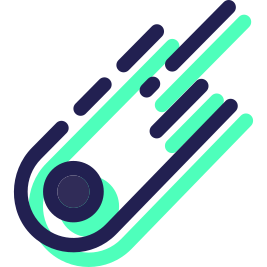

<p style="text-align: center;">

</p>
# vue-template-meteor

> 快速开发，如同流星一样快速！
>
> 基于vue init webpack改造  [https://github.com/vuejs-templates/webpack](https://github.com/vuejs-templates/webpack)
>


## 站在巨人的肩膀上

> 本项目参考了以下项目代码

- vue-template-webpack [https://github.com/vuejs-templates/webpack](https://github.com/vuejs-templates/webpack)
- vue-element-admin [https://github.com/PanJiaChen/vue-element-admin](https://github.com/PanJiaChen/vue-element-admin)

## 技术清单

- vue-router
- vuex
- sass
- svg-sprite
- axios

## 该模板做的一些准备

- 在html中增加了一些常用meta头，favico，设置lang="zh"
- 使用vue-router，axios，vuex，router按需加载，vuex使用module，axios进一步封装为api
- 使用sass预处理器，全局变量等设置到config/*.scss中，使用时不用再@import引入
- 预设组件icon-svg，支持SVGSprite，将所需要用到的svg放到src/icons/svg目录下即可
- 优化vender，vue/vue-router/axios/vuex使用bootCDN(你可以替换为别的)

## Usage

> fork/git clone/download 本仓库（不要忘记把本仓库.git目录删掉）

``` bash
# install dependencies
npm install

# dev
npm run dev

# build for production
npm run build

# build for production and view the bundle analyzer report
npm run build --report
```

## 优化&配置教程

> 这些为该模板做的一些改动说明，不用重复操作

## src下的目录划分

```
- api                经过封装的api接口
- assets             一些静态资源
- components         组件
- svgIcons           svg icons
- style              开发时用到的配置（cssreset/cdn...）
- pages              页面（每个页面一个单独的目录，页面之间的层级关系以此体现，私有组件平铺在该页面下）
- router             vue-router
- store              vuex
- utils              工具类
* App.vue
* main.js
```

### 使用vue-runtime

> 当使用 vue-loader 或 vueify 的时候，*.vue 文件内部的模板会在构建时预编译成 JavaScript。你在最终打好的包里实际上是不需要编译器的，因为只是用运行时构建即可。
>
> 因为运行时构建相比完整版缩减了 30% 的体积，你应该尽可能使用这个版本。

在使用vue init webpack的时候选中vue-runtime only就可以了

参考：https://cn.vuejs.org/v2/guide/installation.html#术语

也可以手动配置

```javascript
// 修改webpack.base.conf.js中的
    alias: {
      'vue$': 'vue/dist/vue.esm.js', // 去掉这句
    }
```

```javascript
// 修改main.js中
new Vue({
  el: '#app',
  render: h => h(App)
})
```


### vue-router,axios,vuex

```npm
npm install --save vue-router axios qs vuex
```
* qs 用来序列化data

具体配置请查看 api/router/store 三个目录下的文件，及main.js

### sass,sass-resources-loader

```npm
npm install --save-dev node-sass sass-loader css-loader sass-resources-loader
```

sass-resources-loader 将指定sass文件全局注入，在别的sass样式中无需再@import

配置方法：

```javascript
/* 找到build目录下的utils.js 添加如下修改 */

/* step 1 添加如下代码 */
function resolveResouce(name) { // 用于配置全局引入的sass的目录
	return path.resolve(__dirname, '../src/style/' + name);
}
function generateSassResourceLoader() {
	var loaders = [
		cssLoader,
		// 'postcss-loader',
		'sass-loader',
		{
			loader: 'sass-resources-loader',
			options: {
				// 	这里是希望全局引入的具体的sass文件,可以自行指定
				resources: [resolveResouce('vars.scss'), resolveResouce('mixins.scss')]
			}
		}
	];
	if (options.extract) {
		return ExtractTextPlugin.extract({
			use: loaders,
			fallback: 'vue-style-loader'
		})
	} else {
		return ['vue-style-loader'].concat(loaders)
	}
}

/* step 2 修改该文件中的return */
sass: generateSassResourceLoader(),
scss: generateSassResourceLoader(),
```

### svg-sprite-loader用法

用于将svg合成svg雪碧图

在src下新建svgIcons目录，结构如下

```
- svgIcons
	- svg               放置所有的svg
	- template          放置svg-icon模板
	* index.js          export
```

```npm
npm install --save-dev svg-sprite-loader
```

```javascript
/* 在build/webpack.base.conf.js添加 */
{
	test: /\.svg$/,
	loader: 'svg-sprite-loader',
	include: [resolve('src/svgIcons')],
	options: {
		symbolId: 'icon-[name]'
	}
}

/* 为了避免跟默认配置冲突，添加exclude */
{
	test: /\.(png|jpe?g|gif|svg)(\?.*)?$/,
	loader: 'url-loader',
	exclude: [resolve('src/svgIcons/svg')], // add exclude
	options: {
		limit: 10000,
		name: utils.assetsPath('img/[name].[hash:7].[ext]')
	}
}
```

为了避免需要将svg icons一个个地引入，使用webpack中的require.context()

```javascript

/* src/SvgIcons/index.js */
const requireAll = requireContext => requireContext.keys().map(requireContext)
const req = require.context('./svg', false, /\.svg$/)
requireAll(req)

/* 在main.js引入svgIcons */
// ...
(() => import(/* webpackChunkName: "svgIcon" */ './svgIcons'))() // 将svg单独打包
// ...
```

### 优化vender，使用bootCDN

vender打包后会变得非常巨大，并且一旦我们改动/升级了某个库，用户就需要重新下载整个vender，不能更好的利用缓存。

为了不影响我们本地开发和使用vue-devtools,copy一份index.html,并重命名为`index.dev.html`和`index.prod.html`

修改`webpack.dev.conf.js`和`webpack.prod.conf.js`中的配置为相对应的html

```javascript
/* webpack.dev.conf.js */
new HtmlWebpackPlugin({
	//...
	template: 'index.prod.html',
	//...
)}

/* webpack.prod.conf.js */
new HtmlWebpackPlugin({
	//...
	template: 'index.prod.html',
	//...
)}
```

在`webpack.prod.config.js`中配置webpack的`externals`

```javascript
/* webpack.prod.conf.js中配置 */
externals: {
	vue: 'Vue',
	'vue-router': 'VueRouter',
	vuex: 'Vuex',
	axios: 'axios'
}
```

在`index.prod.html`中添加这些库对应的cdn

```html
<script src="//cdn.bootcss.com/vue-router/3.0.1/vue-router.min.js"></script>
<script src="//cdn.bootcss.com/vuex/3.0.1/vuex.min.js"></script>
<script src="//cdn.bootcss.com/axios/0.17.1/axios.min.js"></script>
<-- vue runtime -->
<script src="//cdn.bootcss.com/vue/2.5.9/vue.runtime.min.js"></script>
```


## 组件命名

组件名应至少为两位

在template中的组件应使用kebab-case的形式，没有slot的组件应当自闭合

例如：`<AppHeader />`

命名参考

- 全局组件 AppFoo 例如：AppHeader、AppFooter
- 基础组件 BaseFoo 例如：BaseButtonBlue、BaseLink
- 单例组件 TheFoo 每个页面只使用一次。这些组件永远不接受任何 prop 例如：TheAboutUs
- 耦合紧密组件 FooBar 例如：PersonalAvartarUploadButton


## vue 用户自定义代码片段（根据vue官方推荐的顺序排列）

```json
{
	"template": {
		"prefix": "vue",
		"body": [
			"<template>",
			"",
			"</template>",
			"",
			"<script>",
			"export default{",
			"  name: '',",
			"  components: {},",
			"  mixins: {},",
			"  props: {},",
			"  data () {",
			"    return {}",
			"  },",
			"  computed: {},",
			"  watch: {},",
			"  created () {},",
			"  mounted () {},",
			"  methods: {}",
			"}",
			"</script>",
			"",
			"<style lang=''>",
			"",
			"</style>",
			""
		]
	}
}	
```
